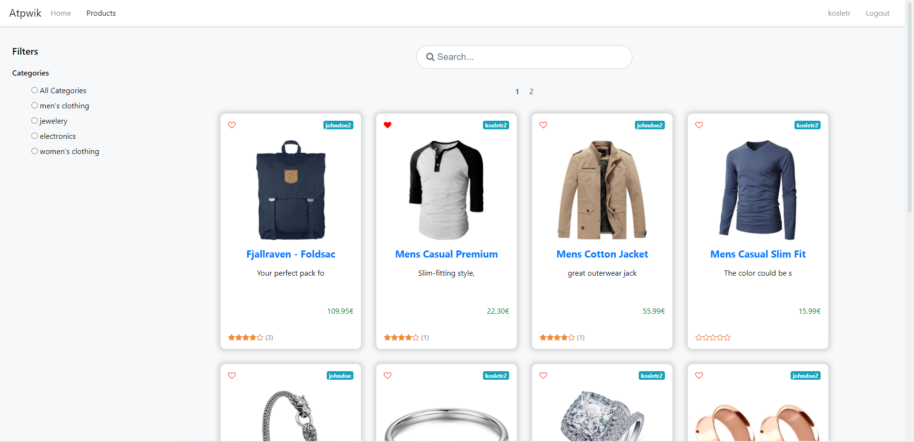
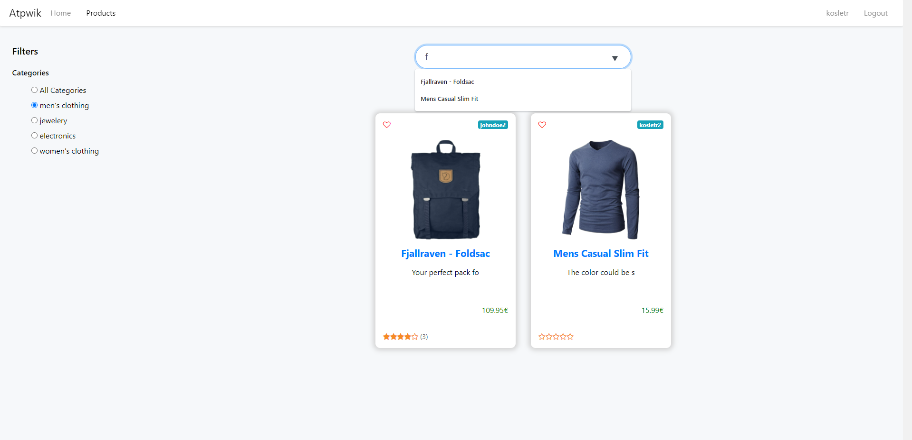
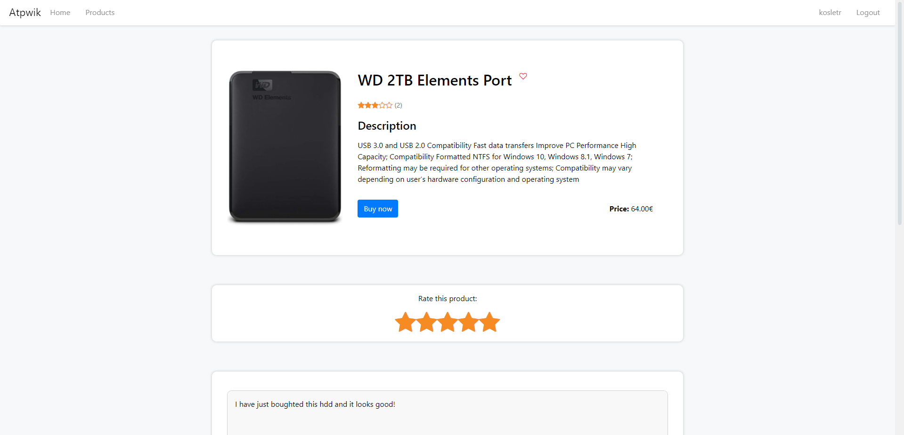
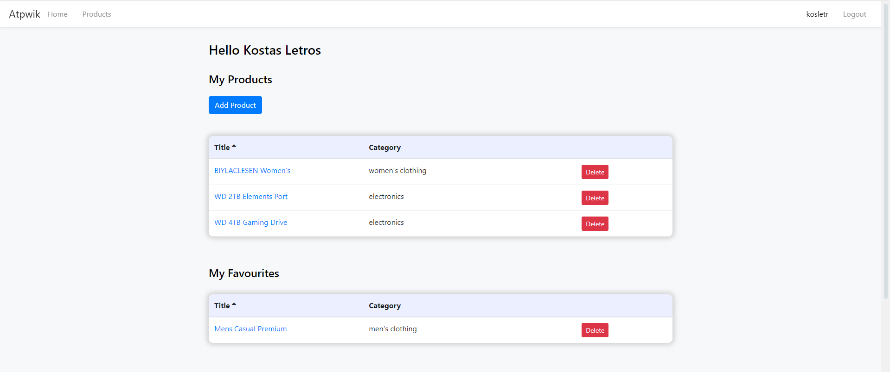
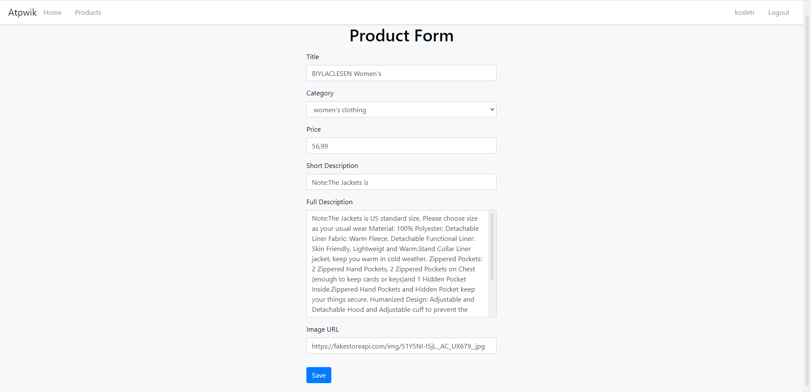

# MERN ATPWIK (MERN Application To Present What I Know)

A Mongodb-Express-Reactjs-Nodejs full stack web application built using mostly pure CSS and additionally the bootstrap css framework along with font-awesome icons to demonstrate my full stack developement knowledge/skills. All of the database models, routes react components etc. are created by me from scratch, though some of them are inspired by or seen in tutorials/courses. The app is still under developement.


# How to run the app

1. To run the app you need to have Node.js (tested for versions >= 12) and MongoDB installed.

2. Install server dependencies by running:

```bash
cd server-app && npm i && cd ..
```

3. Install client dependencies by running:

```bash
cd client-app && npm i && cd ..
```

4. Start both the client and the server app, by running:

```bash
cd server-app
npm run dev
```

docker-compose.yaml and Dockerfiles are comming soon...

# Screenshots of the app so far

## Products page (desktop)



## Products page (mobile)


## Searching and filtering by category



## Products Details



## Comments Section


## Login Form


## Forms have validation


## User's Profile Page



## Profile Admin Panel


## Modify an existing product


